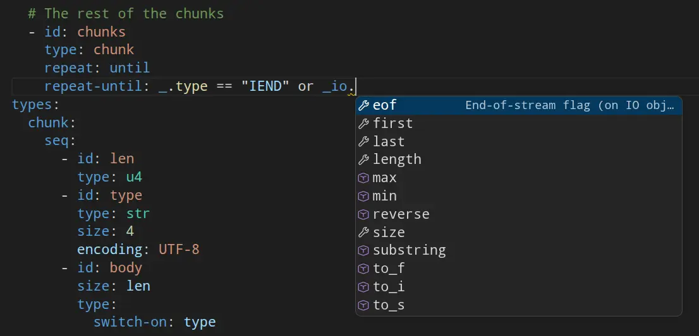
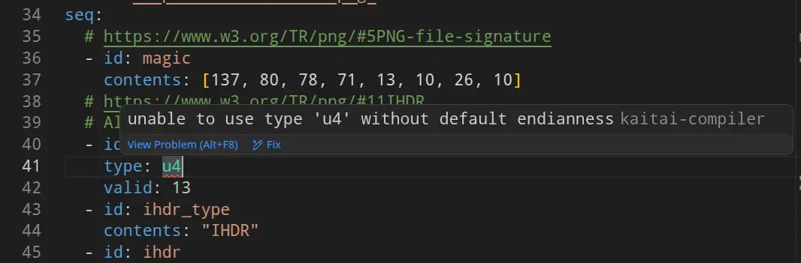
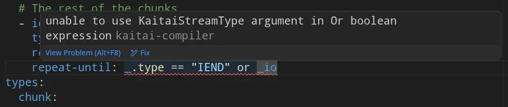
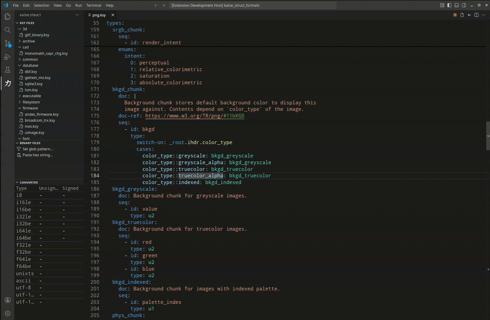
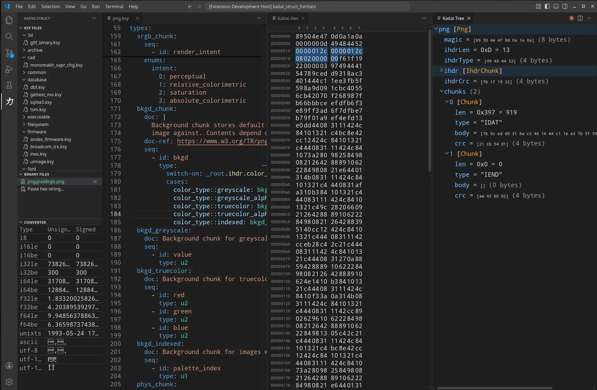

# Kaitai Struct

VS Code extension for [Kaitai Struct](https://kaitai.io/) `.ksy` files.

## Syntax Support

### Autocomplete

<!--  -->

### Normal syntax

Checks top-level and basic syntax

### Expression syntax

Beyond basic Kaitai Struct YAML (.ksy) syntax checking, checks your KSY expressions:

### Tree & Hex View

Open a `.ksy` file and click the file icon in the editor toolbar (or run **Kaitai: Open Hex Viewer**) to open two side panels:

- **Kaitai Hex** — hex dump of the binary file.
- **Kaitai Tree** — parsed structure based on the active `.ksy`.

You can set a *glob* pattern to only display a subset of files (those that are relevant to the KSY at hand) for quick viewing.

**Video**

**Image**

Run **Kaitai: Select Binary File** to pick the binary to parse. Selecting a byte range in either panel highlights the corresponding region in the other.